## １．各種インストール

NetBeans をインストール。  
```
choco install netbeans
```


## ２．payara配置
「payara-4.1.2.173.zip」を、ローカルの適当なフォルダに展開。  
今回の例では、  
C:\tools\payara\  
という階層に、ファイルを展開しています。  
（「C:\tools\payara\payara-4.1.2.173.zip\payara41」という階層にしています。）  


## ３．NetBeans設定
サーバーを追加します。  
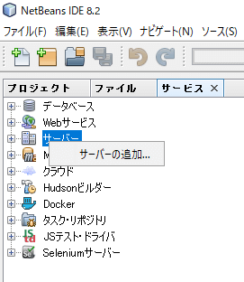  
「２」の手順にて配置した payaraのフォルダを指定します。  
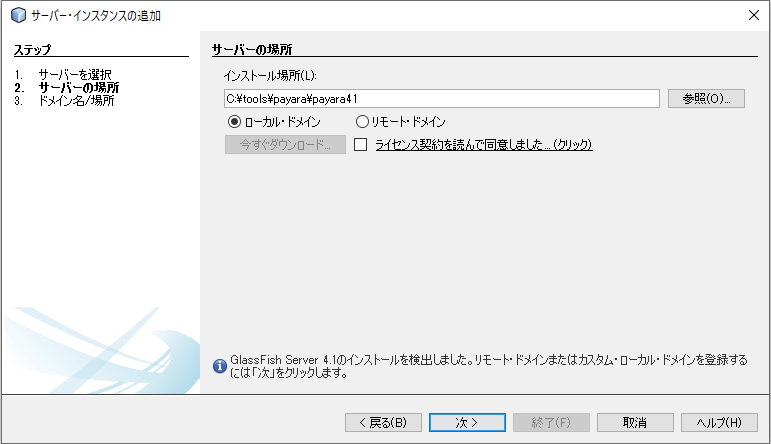  
ドメイン名を「payaradomain」としています。  
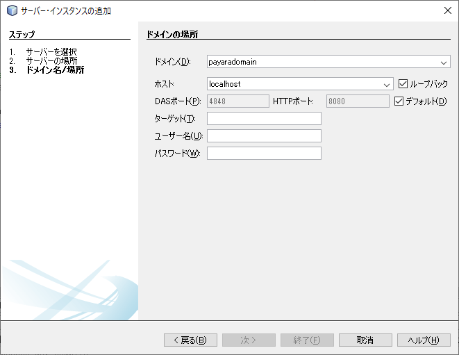  
配置後、管理コンソールが確認できればOKです。  
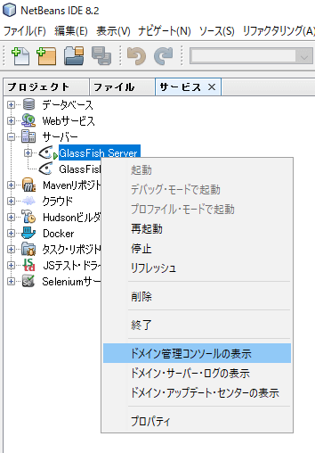  
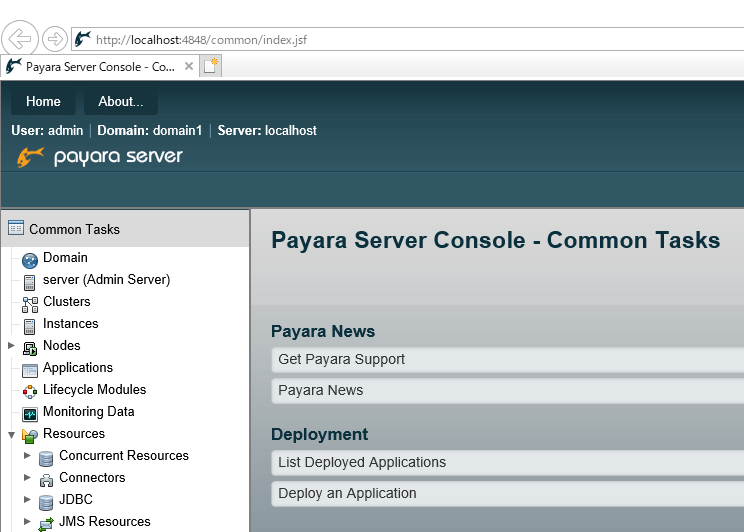  

## ４．jarファイル追加
「インストールに必要なファイル」のフォルダより、以下をコピーします。

 * mysql-connector-java-5.1.36-bin.jar
 * sqljdbc42.jar

payaraを配置したフォルダの lib階層に配置してください。  
今回の例では、  
C:\tools\payara\payara41\glassfish\lib  
に配置します。  


## ５．設定
「インストールに必要なファイル」のフォルダより、以下をコピーします。  
（今回は、「C:\__tmp__」としました。）  

 * domain1_2019_11_07_v00001.zip

その後、コマンドラインから、payaraに設定を反映させます。  
今回の例では、以下のようなコマンドとなります。
```
C:\tools\payara\payara41\bin\asadmin restore-domain --force=true --filename C:\__tmp__\domain1_2019_11_07_v00001.zip payaradomain
```
***※payaraを停止させてから実行してください。設定がうまく反映されません。***


## ４．リポジトリのクローン
プロジェクト：sps_service(SPS)  
SpsEnterpriseApp  
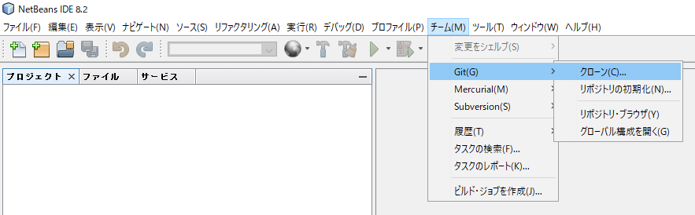  

リポジトリのURL  
https://mothers-sp.backlog.jp/git/SPS/SpsEnterpriseApp.git  
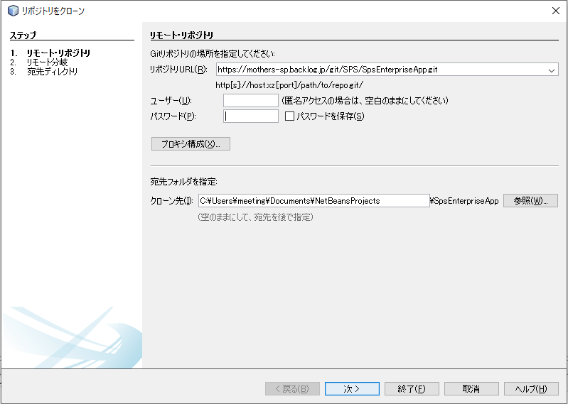  
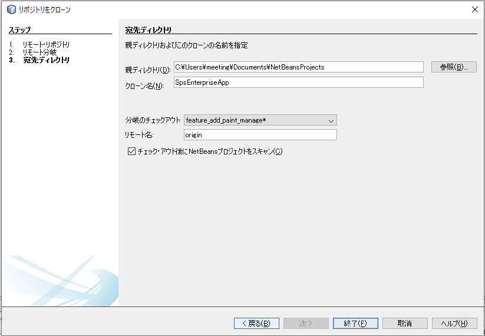  


### ５．ブランチの切り替え
master ブランチには「SpsEnterpriseAppPB5-war」等の必須ファイルが無いため、『pb5_master』ブランチに切り替えてください。  
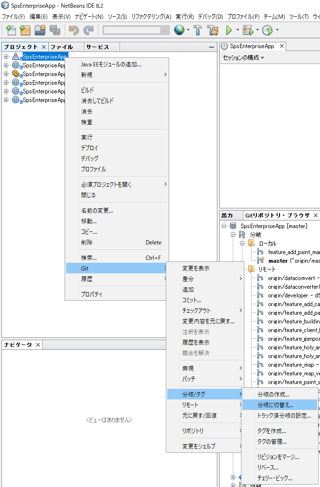  
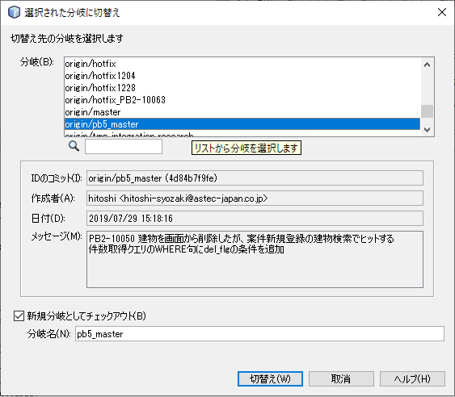  


### ６．必須プロジェクトを開く
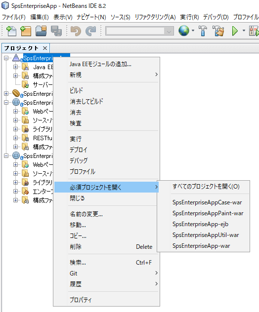  


### ７．実行
実行とデプロイができるようになっています。


________________________________________________________________
# トラブルシュート

## コンフィグファイルのインポート
インポート時、ドメイン名が「domain1（デフォルトのドメイン名）」だと、エラーが発生しました。
```
（実行コマンド）
C:\tools\payara\payara41\bin\asadmin restore-domain --force=true --filename C:\__tmp__\domain1_2019_11_07_v00001.zip domain1


（エラーメッセージ）
com.sun.enterprise.backup.BackupException: The original domain directory ( C:\tools\payara\payara41\glassfish\domains\domain1 ) can't be renamed.  Restore operation aborted.
Command restore-domain failed.
```


## payaraサーバが複数登録されていた場合
起動時にエラーが発生します。  
▲マーク（warning）の付いたアイコンにて右クリックし、「不足しているサーバ問題を解決」を選択してください。
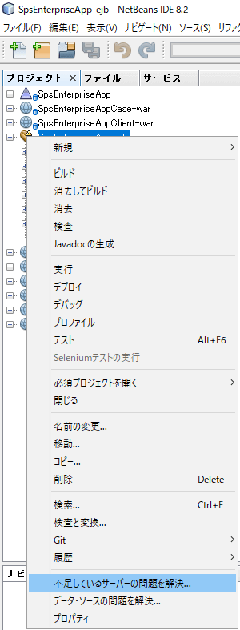  

対象となるサーバを選択してください。  
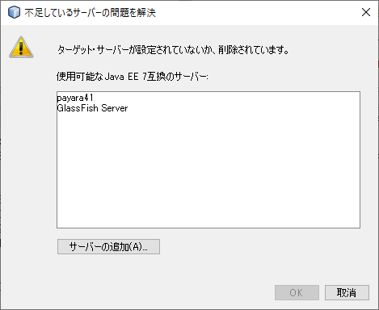  


